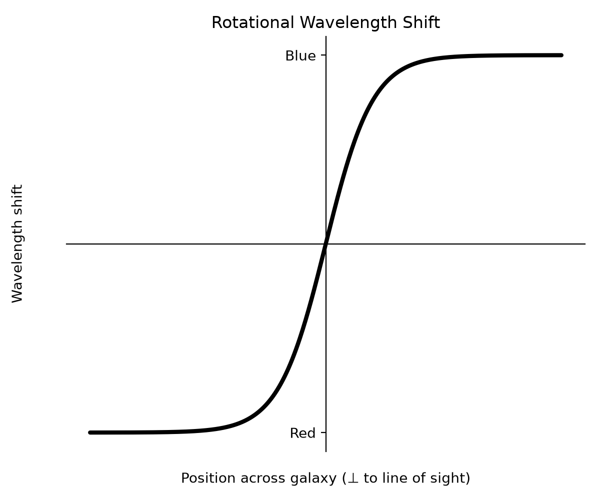
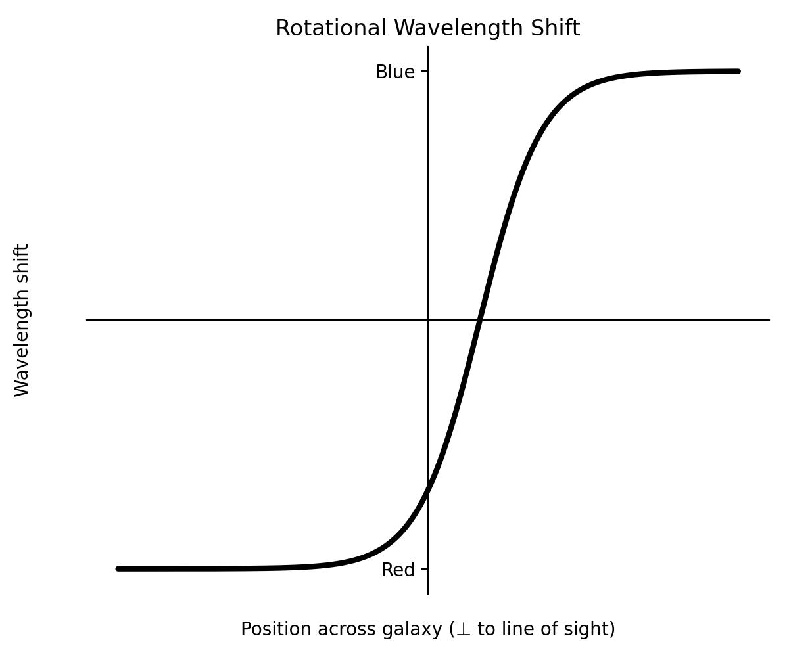
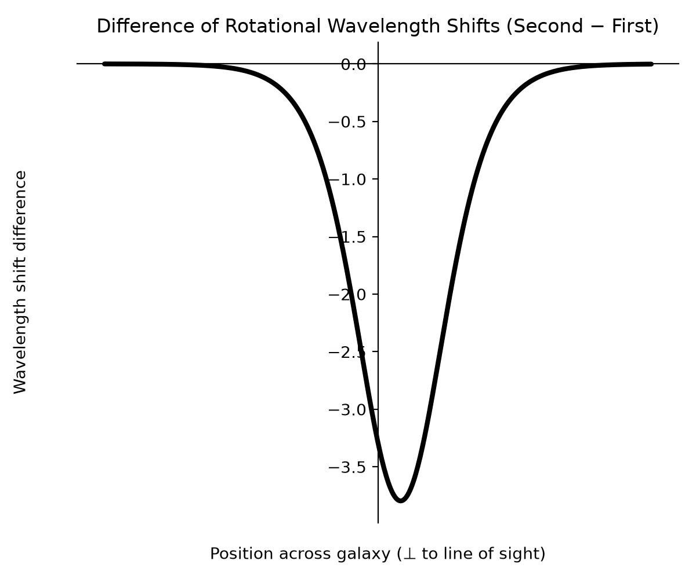
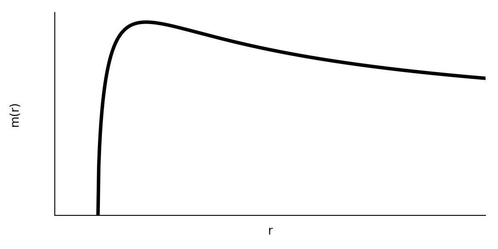

<!-- _class: title-academic -->

Implications of dynamic mass on galactic rotation curves

    

Jonah Cooke

Aug. 15th 2026

Yuan Shi, Plasma Quantum Group

---

**Overview**
* What I'm working on
* Background GR
* Where I'm at
---

**Galactic rotation curves --> rotational velocity gradient**
* rotating galaxies produce a position-dependent wavelength (Doppler) shift due to rotation

###### Right side is rotating towards the observer (redshifted)
<!-- NOTE: verify the Red/Blue tick colors in this figure match this
     convention (Δλ > 0 = redshift, right side); regenerate if not. -->
---
**Spectroscopy issue**

* In more than 50% of spiral galaxies, the kinematic and luminous centers do not overlap [3].

---

**difference in luminosity curves**
The shift is indicative of a function of the form 

---
**solution possibility**
It was shown in [2] that a non-constant mass leads to universal acceleration changes as well as shifts in spectra.

---
**GR background**
* Space time interval 
$$
\begin{aligned}
ds^2 =& dt^2-dx^2-dy^2-dz^2\\
=& g_{\mu\nu} dx^{\mu}dx^{\nu}\\
\end{aligned}
$$
###### Einstein summation convention
* flat space
$$g_{\mu\nu} = 
\begin{bmatrix}
1&0&0&0 \\
0&-1&0&0 \\
0&0&-1&0 \\
0&0&0&-1
\end{bmatrix}$$
---
**GR background cont.**
* timelike $ds^2>0\Rightarrow ds^2 = d\tau^2$ 
* $S = \int d\tau=\int \sqrt{ds^2}=\int \sqrt{\frac{ds^2}{d\lambda^2}}d\lambda =\int\sqrt{g_{\mu\nu}\frac{dx^\mu}{d\lambda}\frac{dx^\nu}{d\lambda}}d\lambda=\int\mathcal{L}d\lambda$

---
**Schwarzschild**
Schwarzschild as estimate of low/non-rotating body in space:
$$ g_{\mu\nu} = 
\begin{bmatrix}
\left(1-\frac{r_s}{r}\right)& 0&0&0 \\
0&-\left(1-\frac{r_s}{r}\right)^{-1}&0&0 \\
0&0&-r^2&0 \\
0&0&0&-r^2sin^2(\theta) \\
\end{bmatrix}
$$
---

**Schwarzschild Cont.**

$$S=m\int\sqrt{g_{\mu\nu}\frac{dx^\mu}{d\lambda}\frac{dx^\nu}{d\lambda}}d\lambda=\int\mathcal{L}d\lambda$$
$$\mathcal{L}  = m\sqrt{(1-\frac{r_s}{r})(t^\prime)^2 - (1-\frac{r_s}{r})^{-1}(r^\prime)^2-r^2(\phi^\prime)^2}$$
prime indicates a partial derivitive w.r.t. the affine parameter $\lambda$

---
**dynamic mass Schwarzschild**

$$\mathcal{L}  = m(r)\sqrt{(1-\frac{r_s}{r})(t^\prime)^2 - (1-\frac{r_s}{r})^{-1}(r^\prime)^2-r^2(\phi^\prime)^2}$$
###### prime indicates a partial derivitive w.r.t. the affine parameter $\lambda$

---
**variable mass Schwarzschild**
*Equation of motion:*

$$\frac{\partial m}{\partial r}\left(1-\frac{r_s}{r}-\dot r^{\,2}\right)=m(r)\left(\ddot r+\frac{r_s}{2\left(r-r_s\right)r}{\dot{r}}^2+\left(r-r_s\right){\dot\phi}^2-\frac{\left(1-\frac{r_s}{r}\right)r_s}{2r^2}{\dot{t}}^2   \right)$$

$$\frac{\partial m}{\partial r}\left(1-\frac{r_s}{r}-\dot r^{\,2}\right)=m(r)\left(\ddot r + \frac{r_s}{2\left(r-r_s\right)r}{\dot{r}}^2 \right)+\frac{\left(1-\frac{r_s}{r}\right)}{m(r)}\left({  \frac{L^2}{r^3}  }-\frac{r_s{E}^2}{2r^2}\right)$$
###### dot indicates derivive with respect to proper time

---
**cicular orbit** 
$$\dot r = 0,\quad \ddot{r}=0$$
$$ \frac{\partial m}{\partial r} =\frac{1}{m(r)}\left(\frac{L^2}{r^3}-\frac{r_sE^2}{r^2}\right)$$
$$m(r)=\sqrt{c+\frac{2E^2}{r}-\frac{L^2}{r^2}} $$
<!-- NOTE: coefficient on E^2/r^2 corrected from 1/2 to 1 so this ODE
     actually integrates to the m(r) given below (verified by direct
     differentiation). Still open: the r_s factor present in the E^2
     term on the previous slide has dropped out here -- confirm this is
     intentional given your definitions of E and L for variable mass,
     since with m(r) non-constant these aren't conserved in the usual
     constant-mass sense. -->

---
**cicular orbit cont.** 

---
**references**

[1] Jog, Chanda J., and Francoise Combes. “Lopsided Spiral Galaxies.” Physics Reports 471, no. 2 (2009): 75–111. https://doi.org/10.1016/j.physrep.2008.12.002.

[2] Shi, Yuan. “Force, Metric, or Mass: Disambiguating Causes of Uniform Gravity.” arXiv:1908.02159. Preprint, arXiv, September 3, 2021. https://doi.org/10.48550/arXiv.1908.02159.

[3] van Eymeren, J., Jütte, E., Jog, C. J., Stein, Y., and Dettmar, R.-J. “Lopsidedness in WHISP Galaxies. I. Rotation Curves and Kinematic Lopsidedness.” Astronomy & Astrophysics 530 (2011): A29. https://doi.org/10.1051/0004-6361/201016177.