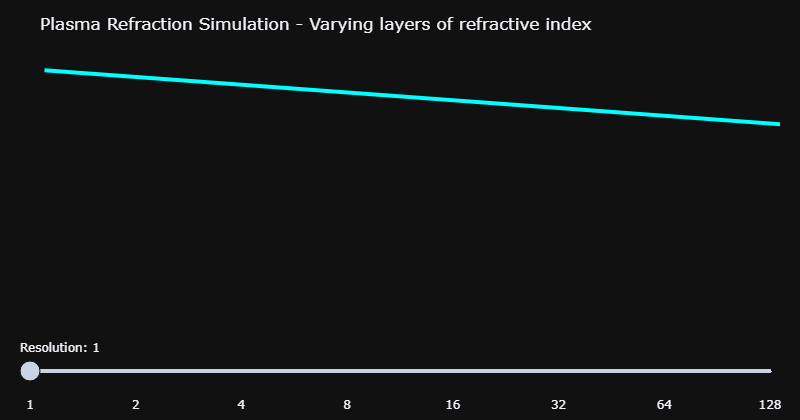
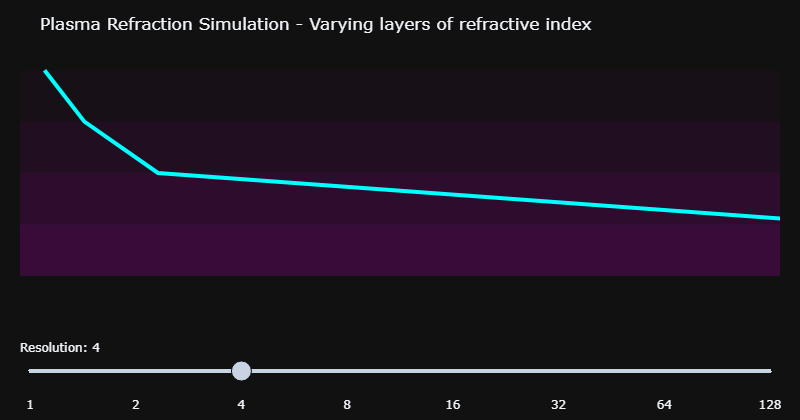
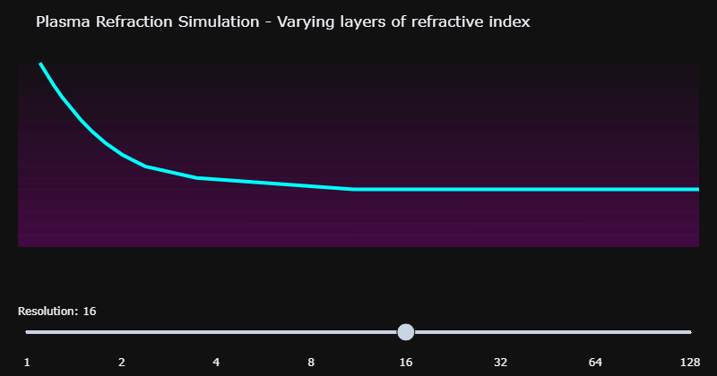
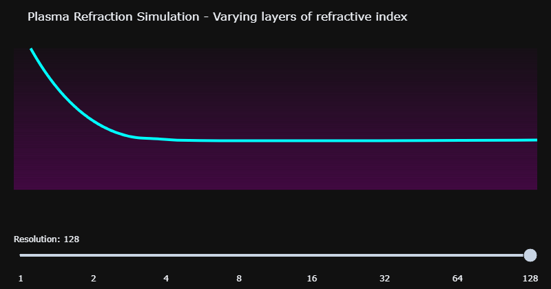

<!-- _class: title-slide -->
<div class="title-wrap">
  <div class="eyebrow">Honors Thesis Update</div>
  <h1>Spatial Mass Distributions and Galactic Stability</h1>
  <div class="meta">Jonah Cooke</div>
  <div class="meta">Yuan Shi, Plasma Quantum Group</div>
  <div class="meta">March 5, 2026</div>
</div>

---
<!-- _class: toc  -->

1. [The Problem](#3)
2. [Whats been tried](#4)
3. [What I'm trying](#5)
4. [why I'm trying it](#6-7)
5. [the process](#6-7)
6. [where Im at](#8)
7. [Next steps](#9)
8. [Ideas for future](#10)
9. [References, Appendix & Credits](#11)
---
# The Problem
<!-- _class: multicolumn -->
<div>
Via newtonian mechanics and a gausian integral we expect the velocity distribution of galaxies to look like:

The data shows it follows a curve like:

</div><div>

</div>

---

<!-- _class: multicolumn -->
<!-- _backgroundColor: black  -->
# Whats been Tried
<div>
<center>

Newtonian physics

$$F = -\frac{GMm}{r^2}\hat{r} $$

<video width="600" height="400" autoplay loop muted>
  <source src="../newtonian.mp4" type="video/mp4">
</video>
</center>
</div><div>
<center>

General Relativistic 
$$R^\lambda_{\:\:\gamma\alpha}$$
<video width="600" height="400" autoplay loop muted>
  <source src="../precesion_fade.mp4" type="video/mp4">
</video>
</center>
</div>
<!-- _footer: Code modified from  -->

---
# What I am trying
<!-- _class: multicolumn -->
<!-- _backgroundColor: black  -->
<div>
<center>
Variable mass:

$$M(r) \propto \sqrt{r} $$ 


<video width="600" height="400" autoplay loop muted>
  <source src="../orbit.mp4" type="video/mp4">
</video>
</center>
</div><div>
<center>
Constant mass:

$$M(r) \propto M $$ 


<video width="600" height="400" autoplay loop muted>
  <source src="../orbit_2.mp4" type="video/mp4">
</video>
</center>
</div>

---

# Why I am trying it do
- light traveling through plasma
$$\omega^2=\omega_p^2+k^2 \Longleftrightarrow E^2=m^2+p^2$$
- plasma frequency
$$\omega_p^2 = \frac{e^2 n(r)}{\epsilon_0m}$$
 - Since $n=n(r)$, maybe $m=m(r)$

---
<!-- _backgroundColor: black  -->
<!-- _class: multicolumn -->
# Why I am trying it cont.
<div>


$$\omega^2=\omega_p^2+k^2 $$
 Light incedent on plama


- $\Delta E = 0 \Rightarrow \Delta \omega = 0 \Rightarrow-\Delta\omega_{p}^2=\Delta k^2$

- In the case $\Delta v < 0 \Rightarrow \Delta\omega_{p}^2>0$
- Since $\omega_{p} \propto n \Rightarrow \Delta n>0$
- $\Delta n > 0\Rightarrow n_1-n_1\frac{\sin(\theta_1)}{\sin(\theta_2)} > 0$

</div><div>
<center>

 <!-- Setting width to 200px -->


</center>
</div>

---
# Why I am trying it cont.

<!-- _backgroundColor: black  -->
<!-- _class: multicolumn -->

<div>
<center>

$$\omega_p^2 = \frac{e^2 n(r)}{\epsilon_0m}$$

</center>
 Light incedent on plama

- $n_1-n_1\frac{\sin(\theta_1)}{\sin(\theta_2)} = \frac{n_1}{\sin(\theta_2)}(\sin(\theta_2)-\sin(\theta_1))$
- since $\theta_1, \theta_2 \in [0, \frac{\pi}{2}]$ for $\Delta n >0,$
- $\sin(\theta_2)>\sin(\theta_1)$ 
- for the domain $[0, \frac{\pi}{2}]$ this implies: $\quad\theta_2>\theta_1$

</div><div>
<center>

 <!-- Setting width to 200px -->


</center>
</div>

---
# The process
$$\mathcal{L} = \mu\frac{\dot r^2}{2}+\mu\frac{r^2\dot \phi^2}{2}- U(r)$$
$$\frac{\partial\mathcal{L}}{\partial{r}}=\frac{d}{dt}\frac{\partial\mathcal{L}}{\partial\dot{r}},\quad\frac{\partial\mathcal{L}}{\partial{\phi}}=\frac{d}{dt}\frac{\partial\mathcal{L}}{\partial\dot{\phi}}$$
$$ \ddot{r} = -\frac{\partial }{\partial r} U_{eff}(r)$$


---
# The process cont.

$$\mathcal{L} = \mu(r)\frac{\dot r^2}{2}+\mu(r)\frac{r^2\dot \phi^2}{2}- U(r)$$

$$ \mu(r)\ddot{r} = -\frac{\partial }{\partial r} U_{eff}(r)$$
$$U_{eff}(r) = \frac{\mu(r)\dot{r}^2}{2}+\frac{G M\mu^2(r)}{\mu(r)r^2} - \frac{\ell^2}{2\mu(r)r^2}$$
---
# where I'm at
1. Paired 1-D constant acceleration Lagrangian to a trajectory via a mass distribution:
  $$\mathcal{L} = -m(z)\sqrt{1-\dot{z}^2}\Longleftrightarrow z(t)=\frac{1}{a}\left(\sqrt{(at)^2+1}-1 \right)$$
  $$m(t)=\frac{1}{\sqrt{(at)^2+1}}\Longleftrightarrow m(z) = \frac{1}{az+1}$$


---
# where I'm at cont.

2. Solved the variable mass 2-body central force Lagrangian for EOM's:
$$\mu(r)\ddot{r} = -\frac{\partial }{\partial r} \left[\frac{\mu(r)\dot{r}^2}{2}+\frac{G M\mu^2(r)}{\mu(r)r^2} - \frac{\ell^2}{2\mu(r)r^2}\right]$$
3. Attempted to solve analytically
4. Created python environment to test trial distributions


---

<!-- _class: black-slide -->
<!-- _class: multicolumn -->
<div>

# code
```python
import pygame
import math
import os
pygame.init()

width, height = 1200, 800
center_x = width/2
center_y = height/2


G = 1
c = 1
M0 = 40000
EH_R = 10
L = 6
dt = 0.1

TAIL_LENGTH = 300      # number of stored points
TAIL_FADE_DIST = TAIL_LENGTH + 500   # fade scale (distance ahead)

white = (255,255,255)
black = (0,0,0)
orange = (255,165,0)

WIN = pygame.display.set_mode((width,height))
pygame.display.set_caption("planet in GR - fading tail")


def M_of_r(r):
    return M0 


def rphi_to_xy(r, phi):
    x = center_x + r*math.cos(phi)
    y = center_y + r*math.sin(phi)
    return x, y


def derivatives(r, phi, vr, omega):
    M = M_of_r(r)
    Fr = -(G*M/r**2)*(1 + (3*L**2/(c**2*r**2)))

    drdt = vr
    dphidt = omega
    dvrdt = r*omega**2 + Fr
    domegadt = -2*vr*omega/r

    return drdt, dphidt, dvrdt, domegadt


```
</div><div>


```python
def RK4(r, phi, vr, omega):

    k1 = derivatives(r, phi, vr, omega)

    k2 = derivatives(
        r + k1[0]*dt/2,
        phi + k1[1]*dt/2,
        vr + k1[2]*dt/2,
        omega + k1[3]*dt/2
    )

    k3 = derivatives(
        r + k2[0]*dt/2,
        phi + k2[1]*dt/2,
        vr + k2[2]*dt/2,
        omega + k2[3]*dt/2
    )

    k4 = derivatives(
        r + k3[0]*dt,
        phi + k3[1]*dt,
        vr + k3[2]*dt,
        omega + k3[3]*dt
    )

    dr = dt*(k1[0] + 2*k2[0] + 2*k3[0] + k4[0])/6
    dphi = dt*(k1[1] + 2*k2[1] + 2*k3[1] + k4[1])/6
    dvr = dt*(k1[2] + 2*k2[2] + 2*k3[2] + k4[2])/6
    domega = dt*(k1[3] + 2*k2[3] + 2*k3[3] + k4[3])/6

    return dr, dphi, dvr, domega


class Planet:
    def __init__(self, r, phi, vr, omega):
        self.r = r
        self.phi = phi
        self.vr = vr
        self.omega = omega
        self.path = []
```
</div><div>

```python

    def update(self):
        if self.r > EH_R:
            dr, dphi, dvr, domega = RK4(self.r, self.phi, self.vr, self.omega)
            self.r += dr
            self.phi += dphi
            self.vr += dvr
            self.omega += domega

        x, y = rphi_to_xy(self.r, self.phi)
        self.path.append((x,y))

        if len(self.path) > TAIL_LENGTH:
            self.path.pop(0)

    def draw(self, win):
        x, y = rphi_to_xy(self.r, self.phi)

        # draw fading tail
        for i in range(1, len(self.path)):
            p1 = self.path[i-1]
            p2 = self.path[i]

            dx = x - p1[0]
            dy = y - p1[1]
            dist = math.sqrt(dx*dx + dy*dy)

            alpha = max(0, 255 * (1 - dist/TAIL_FADE_DIST))
            color = (int(alpha), int(alpha), int(alpha))

            pygame.draw.line(win, color, p1, p2, 2)

        pygame.draw.circle(win, orange, (int(x),int(y)), 5)


class Mass:
    def __init__(self, R):
        self.x = center_x
        self.y = center_y
        self.R = R

    def draw(self, win):
        pygame.draw.circle(win, white, (int(self.x),int(self.y)), int(self.R))
def main():
    os.makedirs("frames", exist_ok=True)
    frame_number = 0
    MAX_FRAMES = 600   # for example
    frames = []
    run = True
    clock = pygame.time.Clock()

    black_hole = Mass(EH_R)

    r0 = 200
    phi0 = 0
    vr0 = -2

    M_init = M_of_r(r0)
    omega0 = math.sqrt((G*M_init/r0**3)*(1 + (3*L**2/(c**2*r0**2))))
```
</div><div>


```python


    planet = Planet(r0, phi0, vr0, omega0)

    while run:
        clock.tick(60)
        WIN.fill(black)

        for event in pygame.event.get():
            if event.type == pygame.QUIT:
                run = False

        black_hole.draw(WIN)
        planet.update()
        planet.draw(WIN)
        if frame_number < MAX_FRAMES:
            pygame.image.save(WIN, f"frames/frame_{frame_number:04d}.png")
            frame_number += 1
        pygame.display.update()

    pygame.quit()
main()

```
</div>


---
<!-- _backgroundColor: Black  -->

<video width="1200" height="800" autoplay loop muted>
  <source src="../Large_modified_orbit.mp4" type="video/mp4">
</video>

---

# Next steps
1. Find trajectory data.
2. Guess form of $\mu(r)$ based off of data.
3. With analytic form of $\mu(r)$ try to find analytic form of $r(\phi)$
3. Add reletivistic corrections.
4. Hone simulation.
5. Apply model to many different systems and check if results agree with observation.
---
# Ideas for future
- How does a variable mass distribution account for Gravitational lensing, and other pieces of evidence supporting dark matter?
- Does this have any implications regarding current quantum gravity frameworks?


---

# References

<div class="multicolumn"><div>

1. 

</div><div>


</div></div>

---

[]()

<style scoped>
h2>a{
  color: red;
}
</style>

<!-- _class: blank -->

<div align="center">

# <!-- fit --> [Back to the](#1)

## <!-- fit --> [beginning](#1)

</div>


